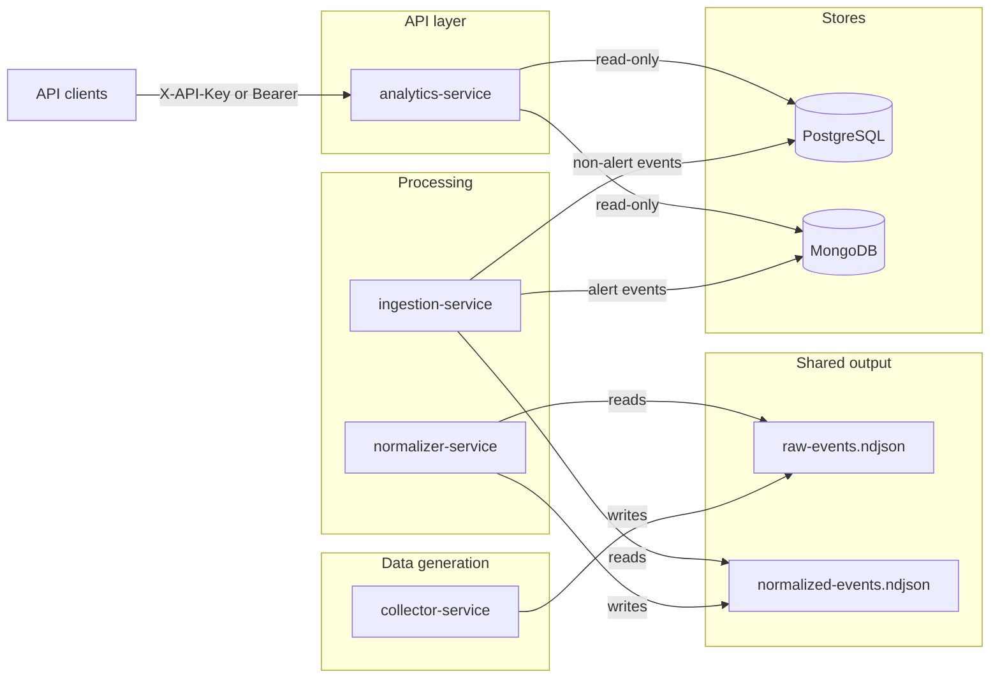

# Endpoint Security Demo

**Repository:** [https://github.com/vnagir/endpoint-security-demo](https://github.com/vnagir/endpoint-security-demo)

Simulated endpoint security pipeline with four microservices: **collector**, **normalizer**, **ingestion**, and **analytics**. Data flows via shared files and databases; each service can be run, paused, or scaled independently.

## Architecture

- **collector-service**: Generates raw (intentionally messy) events; writes `./output/raw-events.ndjson`.
- **normalizer-service**: Reads raw NDJSON, normalizes and filters; writes `./output/normalized-events.ndjson`.
- **ingestion-service**: Reads normalized NDJSON; writes non-alert events to **PostgreSQL**, alert events to **MongoDB**.
- **analytics-service**: REST API (read-only) from PostgreSQL and MongoDB; JWT/API Key auth and role-based access.

### Architectural flow

Data moves in one direction through the pipeline. Services do not call each other over HTTP; they share files and databases.



| Stage | Service | Input | Output |
|-------|---------|--------|--------|
| 1 | collector-service | — | `raw-events.ndjson` |
| 2 | normalizer-service | `raw-events.ndjson` | `normalized-events.ndjson` |
| 3 | ingestion-service | `normalized-events.ndjson` | PostgreSQL (events), MongoDB (alerts) |
| 4 | analytics-service | PostgreSQL, MongoDB | REST API (summary, alerts, endpoint list) |

## Quick Start (Docker Compose)

**Prerequisites:** Docker and Docker Compose.

```bash
# From repo root
docker compose up --build -d
```

The **collector** and **normalizer** create the `output` directory automatically if it does not exist (in Docker, the `./output` bind mount is also created by Docker when the first container using it starts).

Wait for Postgres and MongoDB to be healthy and for the analytics-service to start.

**Try the API:** Use **curl** (examples below) or **[Swagger UI](http://localhost:8080/swagger-ui.html)** in your browser. In Swagger UI, click **Authorize**, enter `analyst-token-67890` or `admin-token-12345` in **X-API-Key** (or Bearer), then **Try it out** on any endpoint.

```bash
# Health
curl -s http://localhost:8080/actuator/health

# List unique endpoint IDs, paginated (Analyst or Admin; page=0, size=20 default)
curl -s -H "X-API-Key: analyst-token-67890" \
  "http://localhost:8080/api/v1/endpoints?page=0&size=20"

# Event summary for an endpoint (Analyst or Admin)
curl -s -H "X-API-Key: analyst-token-67890" \
  "http://localhost:8080/api/v1/summary/YOUR_ENDPOINT_UUID"

# Alerts, paginated (Admin only; page=0, size=10 default)
curl -s -H "X-API-Key: admin-token-12345" \
  "http://localhost:8080/api/v1/alerts?min_score=50&page=0&size=10"

# Unauthorized (403)
curl -s -H "X-API-Key: analyst-token-67890" \
  "http://localhost:8080/api/v1/alerts"
```

**Alternative — Swagger UI:** Open [http://localhost:8080/swagger-ui.html](http://localhost:8080/swagger-ui.html) to explore and call the API from your browser. OpenAPI spec (JSON): [http://localhost:8080/v3/api-docs](http://localhost:8080/v3/api-docs). All `/api/v1/**` endpoints require authentication: click **Authorize**, enter your API key in **X-API-Key** or **Bearer token**, then **Try it out** on any endpoint.

**Test tokens (hardcoded):**

| Token               | Role    | Access                                          |
|---------------------|---------|--------------------------------------------------|
| `admin-token-12345` | ADMIN   | `/api/v1/endpoints`, `/api/v1/summary`, `/api/v1/alerts` |
| `analyst-token-67890` | ANALYST | `/api/v1/endpoints`, `/api/v1/summary` only      |

Send the token in the **`X-API-Key`** header. The API also accepts **`Authorization: Bearer <token>`** for the same value if your client prefers that.

## API authentication: tokens and testing

### How to obtain a token/key

In this demo, **tokens are hardcoded** in the analytics-service; there is no token-issuing service or generation step. Use the values in the table above:

- **Analyst:** `analyst-token-67890`
- **Admin:** `admin-token-12345`

In a production setup you would obtain tokens from an identity provider or API gateway (e.g. OAuth2/OIDC issuer or an API key management service). This demo skips that and uses fixed tokens for quick local and Docker testing.

### Testing authorized access

Use a valid token in the request. Expected: **200 OK** (or 404/400 when applicable).

```bash
# Analyst: list endpoint IDs, get summary
curl -s -w "\nHTTP %{http_code}\n" -H "X-API-Key: analyst-token-67890" \
  "http://localhost:8080/api/v1/endpoints"
curl -s -w "\nHTTP %{http_code}\n" -H "X-API-Key: analyst-token-67890" \
  "http://localhost:8080/api/v1/summary/YOUR_ENDPOINT_UUID"

# Admin: same as analyst, plus alerts
curl -s -w "\nHTTP %{http_code}\n" -H "X-API-Key: admin-token-12345" \
  "http://localhost:8080/api/v1/alerts"
```

### Testing unauthorized access

**Missing or invalid token → 401 Unauthorized**

```bash
# No token
curl -s -w "\nHTTP %{http_code}\n" "http://localhost:8080/api/v1/endpoints"
# Expect: 401, JSON body with "error": "Unauthorized"

# Invalid or unknown token
curl -s -w "\nHTTP %{http_code}\n" -H "X-API-Key: wrong-token" \
  "http://localhost:8080/api/v1/summary/550e8400-e29b-41d4-a716-446655440000"
# Expect: 401
```

**Valid token but insufficient role → 403 Forbidden**

```bash
# Analyst calling admin-only alerts endpoint
curl -s -w "\nHTTP %{http_code}\n" -H "X-API-Key: analyst-token-67890" \
  "http://localhost:8080/api/v1/alerts"
# Expect: 403, JSON body with "error": "Forbidden"
```

The helper script `scripts/test-api.sh` runs a small set of these scenarios (health, endpoints, summary, alerts, and the analyst-forbidden case).

## Build and Run Locally

**Prerequisites:** Java 21, Maven 3.9+, PostgreSQL 15+, MongoDB 7+.

```bash
# Build all modules
mvn clean package

# 1. Start Postgres and Mongo (or use Docker for DBs only)

# 2. Collector (writes raw-events.ndjson)
java -jar collector-service/target/collector-service-1.0.0-SNAPSHOT.jar

# 3. Normalizer (reads raw, writes normalized-events.ndjson)
java -jar normalizer-service/target/normalizer-service-1.0.0-SNAPSHOT.jar

# 4. Ingestion (reads normalized, writes to DBs)
export DATABASE_URL=jdbc:postgresql://localhost:5432/endpoint_security
export MONGODB_URI=mongodb://localhost:27017/endpoint_security
java -jar ingestion-service/target/ingestion-service-1.0.0-SNAPSHOT.jar

# 5. Analytics API (port 8080)
java -jar analytics-service/target/analytics-service-1.0.0-SNAPSHOT.jar
```

Run collector and normalizer so that `./output/raw-events.ndjson` and `./output/normalized-events.ndjson` are produced; ingestion will pick up the normalized file; then use the API.

## Project Structure

```
endpoint-security-demo/
├── pom.xml                 # Parent POM
├── docker-compose.yml      # Postgres, Mongo, collector, normalizer, ingestion, analytics
├── collector-service/      # Raw event generation → raw-events.ndjson
├── normalizer-service/     # Raw → normalized-events.ndjson
├── ingestion-service/      # Normalized → Postgres + MongoDB
├── analytics-service/      # REST + auth, reads from DBs
├── output/                 # Shared volume: raw-events.ndjson, normalized-events.ndjson
└── scripts/
    └── test-api.sh         # Example API calls
```

## API Endpoints

Swagger UI shows **3 main endpoints** (one helper route is hidden). All list endpoints are **paginated**.

| Method | Path | Auth | Description |
|--------|------|------|-------------|
| GET | `/api/v1/endpoints` | Analyst, Admin | List unique endpoint IDs; query params `page` (0-based), `size` (default 20, max 100) |
| GET | `/api/v1/summary/{endpointId}` | Analyst, Admin | Event count, most frequent process, event type breakdown (single resource, no pagination) |
| GET | `/api/v1/alerts` | Admin only | Alerts; query params `endpoint_id`, `min_score`, `page` (0-based), `size` (default 10, max 100) |

**Paginated response shape** (for `/endpoints` and `/alerts`): `totalResultCount`, `totalPages`, `currentPage` (1-based), `countPerPage`, `content` (array of items).

Interactive API docs: **[Swagger UI](http://localhost:8080/swagger-ui.html)** — use **Authorize** (X-API-Key or Bearer) with a test token, then **Try it out** on any endpoint.

## Limiting ingestion volume

To avoid feeding too much data at once, cap how many records ingestion processes per file poll:

- **Environment:** `INGESTION_MAX_RECORDS_PER_POLL=500` (process at most 500 lines per poll; 0 = no limit).
- **Docker Compose:** set in `environment` or run: `INGESTION_MAX_RECORDS_PER_POLL=500 docker compose up -d ingestion-service`.
- **Locally:** `java -jar ... -Dingestion.max-records-per-poll=500` or set in `application.properties`.

Poll interval (default 3000 ms) is configurable via `INGESTION_POLL_INTERVAL_MS` or `ingestion.poll-interval-ms`.

## Operational Notes

- **Pause ingestion:** `docker stop endpoint-security-ingestion` — collector and normalizer keep writing files; analytics API still serves existing data.
- **Stop analytics:** collector, normalizer, and ingestion keep running; data continues to be collected and loaded.
- **Shared volume:** `./output` must be mounted (or shared) between collector, normalizer, and ingestion when using Docker.

## Design decisions and trade-offs

This section outlines trade-offs and design decisions regarding multi-module structure, technology choice, schema, scalability, read/write characteristics, and security. The demo uses four deployable services with loose coupling via files and DBs (no service-to-service HTTP).

### Why a multi-module (four-service) project

We split the pipeline into four services (collector, normalizer, ingestion, analytics) instead of one monolith so that:

- **Separation of concerns:** Each service has a single responsibility (generate raw events, normalize, persist to DBs, serve API). This keeps the codebase easier to reason about and change.
- **Independent scaling and deployment:** Collector and normalizer can be scaled for throughput; ingestion can be tuned for write load; analytics can be scaled for read load. Each can be deployed or rolled back without touching the others.
- **Clear data-flow stages:** The pipeline is explicit (files then DBs), which matches the requirement for a staged pipeline and makes it obvious where data lives at each step.
- **Technology fit per stage:** We can choose storage per stage (files for buffering, Postgres for events, Mongo for alerts) without forcing one stack on the whole pipeline.
- **Alignment with microservices / 12-Factor style:** Small deployable units, config via environment, stateless API; the requirement called for microservices principles, and multi-module supports that.

Trade-off: more services mean more operational surface (build, deploy, monitor) and eventual consistency across the pipeline; we accept that for clarity and independent evolution.

### Why PostgreSQL (vs other RDBMS)

We use **PostgreSQL** for the main event store (`security_events`) rather than MySQL, SQL Server, or other RDBMS because:

- **Strong ACID and reliability:** Event data must not be lost or duplicated at scale; Postgres gives predictable transactional semantics and durability.
- **Structured event log:** Events have a fixed, relational shape (endpoint, time, type, user, process, alert flag). A relational model fits this well; we do not need a document store for the main event table.
- **Indexing and partitioning:** Postgres has mature support for B-tree indexes and declarative table partitioning by time, which we rely on for scalability to hundreds of millions of rows (see Scalability). Other RDBMS offer similar features, but Postgres is widely used for analytics and event workloads and has strong ecosystem and Spring Data JPA support.
- **Operability:** Good Docker and cloud support, straightforward backups and point-in-time recovery. We did not need a proprietary RDBMS; Postgres is a standard choice for this kind of workload.

### Why MongoDB (vs other NoSQL stores)

We use **MongoDB** for alerts rather than Cassandra, DynamoDB, Redis, or other NoSQL stores because:

- **Document model for alerts:** Alert payloads can evolve (new fields, nested data); a document store avoids schema migrations for every change and fits “store this JSON-like alert” well.
- **Access pattern:** Alerts are written once and read by filters (score, time, endpoint). MongoDB’s indexed queries and small result sets (e.g. top N) match this; we do not need global secondary indexes or key-value semantics that would push us toward DynamoDB or Cassandra for this demo.
- **Polyglot persistence:** The requirement specified a relational store for events and a NoSQL store for alerts. MongoDB is a common choice alongside Postgres for that split, with strong Spring Data MongoDB support and simple local/Docker setup.
- **Trade-off vs other NoSQL:** Cassandra or DynamoDB could handle very high write throughput and global distribution; we did not need that for the demo. Redis could cache alerts but is not our primary store. MongoDB gives a good balance of flexibility, queryability, and operational familiarity for the alert use case.

### Scalability when records reach hundreds of millions

- **PostgreSQL:**
  - **Indexing:** Indexes on `(endpoint_id, timestamp)` and `timestamp` keep summary and time-range queries efficient as the table grows. Queries are written to use these indexes (e.g. summary by endpoint, list of distinct endpoint IDs).
  - **Scaling further:** For 100M+ rows, add **table partitioning** by time (e.g. monthly) so old partitions can be archived or dropped; use **read replicas** for analytics read load; and **connection pooling** (e.g. PgBouncer) for write throughput. This demo does not implement partitioning but the schema and indexes are compatible with it.
  - A single table remains scalable with proper indexes and partitioning; the main lever is partitioning and archiving by time.
- **MongoDB:**
  - **Indexes:** Indexes on `(endpointId, timestamp)` and `alertScore` keep alert listing and filtering efficient.
  - **Scaling:** For very large alert volumes, use **sharding** (e.g. by `endpointId` or time) and **replication** for read scaling. The current design (one collection, indexed) is sufficient for the demo and can be extended with sharding for huge volumes.

### Read/write characteristics

- **PostgreSQL:**
  - **Writes:** Append-only inserts; the single table with indexes supports good insert throughput. The ingestion service uses batch-style processing (reading NDJSON and flushing in batches), which reduces round-trips compared to single-row inserts.
  - **Reads:** Summary by `endpoint_id` and the list of distinct endpoint IDs are index-backed. We optimize for these read patterns, not ad-hoc full table scans. Actual throughput and latency depend on hardware and configuration.
- **MongoDB:**
  - **Writes:** Alert documents are inserted as they are normalized; the document model avoids joins and keeps writes simple.
  - **Reads:** Alert listing by score, time, or endpoint uses indexes; small result sets (e.g. top N) keep latency low. As with Postgres, actual numbers depend on hardware and configuration.

### Security implementation trade-offs

- **API Key / Bearer:** A single mechanism (token lookup) is exposed via two header forms (`X-API-Key` and `Authorization: Bearer`) for client convenience. Trade-off: simplicity vs. full OAuth2/OIDC (no refresh tokens, no PKCE in this demo).
- **Hardcoded tokens:** Tokens are hardcoded for demo use only. Trade-off: ease of local and Docker testing vs. production-ready secrets management (vault, env, or a proper identity provider).
- **Role-based access:** Analyst vs. Admin are enforced with `@PreAuthorize` on controller methods. Trade-off: a simple two-role model vs. fine-grained permissions; sufficient for the demo’s access requirements.
